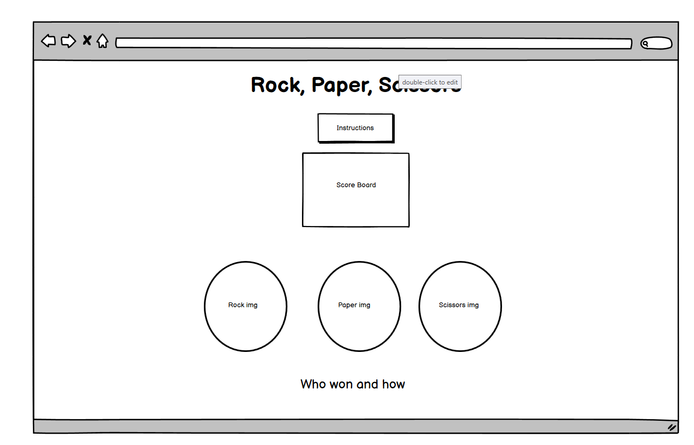
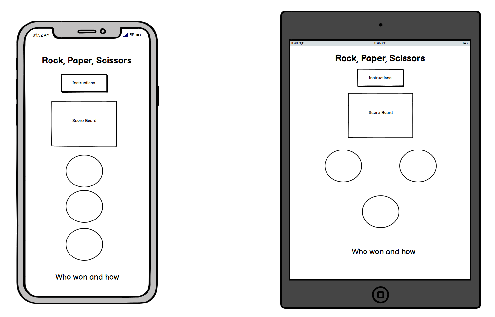

<h1 style="text-align: center">Rock, Paper, Scissors</h1>

A classic game of rock, paper, scissoers just to play and have fun!

## Target Audience

This game can be played by anyone at anytime, though it will be aimed at a younger audience in terms of design. The rules will be included for anyone that has never played before.

## UX Design

### User Stories

#### First time visitor

* I want a first time visitor to be able to see everything on the same page and its use to be obvious. I will do that with a big title, (Rock, Paper, Scissors), a score board, and three big clickable icons to play the game with.

* If they don't already know the rules I will have a bright, colourful button with the instructions just under the title.

### Colour

I wanted to make this game bright and bold to appeal to a younger audience and have chosen to go with high contrast primary and secondary colours, making it easy to see and provide visual feedback to the user.

* Blue, orange and white will be used.
* It will be one page to keep it simple with a button and a modal for the instructions and rules.

### Typography

* As this will be aimed at a generally younger audience I will be using a bold and bubbly font for the title (Fredoka One) and a similarly rounded and spaced font for the rest of the text to make it easy to read (Prompt).

### Images

* Images used in the player choice buttons came from [Creazilla](https://creazilla.com/)

### Wireframes

## Technologies

### Languages Used

* HTML
* CSS
* JavaScript

### Libraries Used

* Bootstrap
    * Page layout and modal
* Google Fonts
    * Importing typography
* Balsamiq
    * Used for creating wireframes

## Testing

### Manual Testing

Manual testing mainly consisted of using console.logs to check the eventListeners were pushing the player and computer choices to the correct objects. I have left them in the code in order for anyone reviewing the code to easily see what how it functions. The following table documents this in detail.

### Automated Testing

This can be found in the assets/tests folder in the GitHub repository.

### Bugs

* TypeError: Cannot read properties of null (reading 'querySelector')
    * I can find no solution to this bug. It claims it cannot read the property of the DOM element, which means that my code should not be working. However it works fine in my preview. I have spent a long time trying to fix this issue previously and spoke to two tutors on the support chat, neither could figure out why and scouring the web hasn't had anything fruitful. The only solution was to a problem I didn't have which was the script link being in the head of the HTML document. I will be testing manually from this point forward following the same procedure.

## Deployment

### Deploying the Website

1. Start by logging in to GitHub and finding my repository.
2. Under Environments on the right hand side click github-pages.
3. Next to the top item on the deployment history list click the View Deployment button. This will open the page in a seperate tab for you to view.

### Forking the Repository
By forking the repository you will create a copy to your own Github account. Here you will be able to view or edit code without changing the original repository.

1. Start by logging in to GitHub and finding my repository.
2. In the top right hand corner of the window you will find the fork button.
3. You should now have your own copy of the repository.

### Cloning the Repository
You can also clone the repository to use locally.

1. Start by logging in to GitHub and finding [my repository](https://github.com/Charlie-Walsh/rock-paper-scissors).
2. To the left of the green Gitpod button is the Code dropdown button.
3. To clone using HTTPS copy the link under HTTPS.
4. Open Git Bash.
5. Make sure you change the working directory to the location you want the cloned directory to go.
6. Type "git clone" and paste the url you copied after it.
7. Press enter and your clone will be created.

